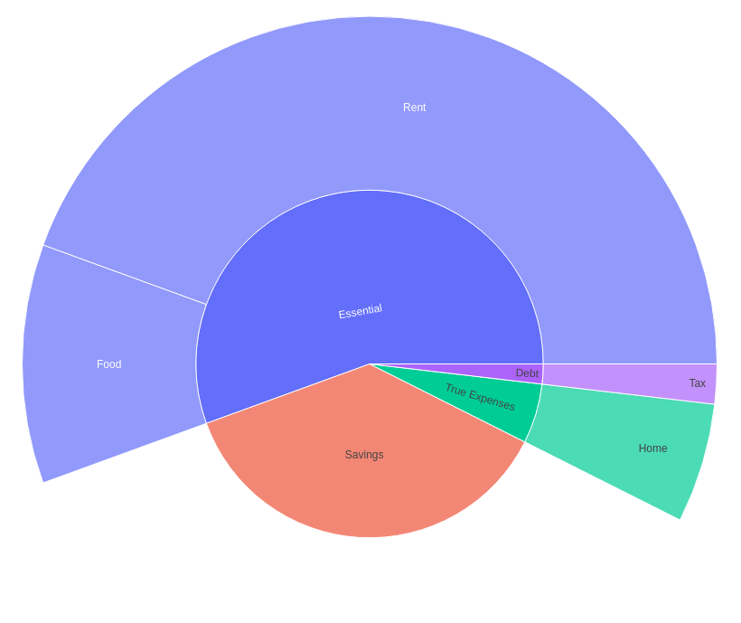

# `minibudget chart`

`minibudget chart` is a way to visualise the data in minibudget
files as various charts. It uses [plotly](https://github.com/plotly/plotly.py) to generate interactive
charts which can be used to help understand your finances.

## Chart Types

### `minibudget chart sunburst ./example.budget`

A sunburst chart for *expenses* in a budget. Shows the hierarchy of
different categories in your budget and how they comprise a total.

